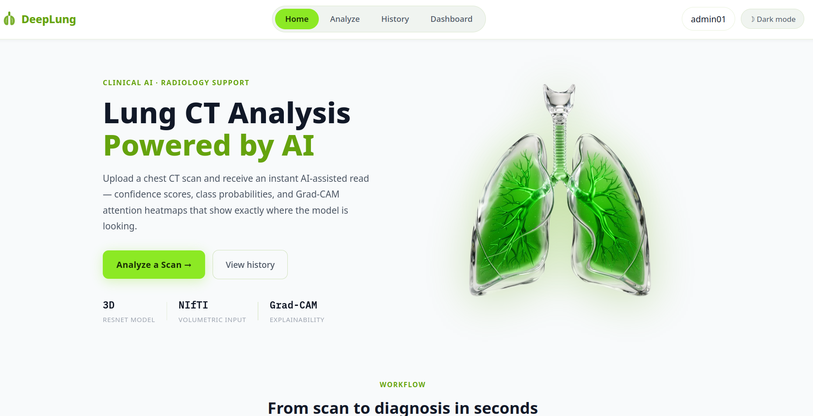

# DeepLung CT Bachelor Project

AI-assisted lung CT scan analysis. Upload a chest CT scan and receive a prediction (Benign or Malignancy) with confidence scores and a Grad-CAM heatmap showing where the model focused.



---

## Requirements

- **Node.js** (v18 or later)
- **.NET SDK 8**
- **Python 3.11 or 3.12** with a virtual environment in `backEnd/inferenceService/.venv`

---

## Starting the Application

### Linux and macOS (Auto-start script, recommended)

Run this once from the project root:

```bash
./autoStartAllOS.sh
```

This opens three terminal windows automatically:
- .NET API on port 5056
- Python inference service on port 8001
- React frontend on port 5173

> Dependencies are installed automatically — `pip install` for the inference service and `npm install` for the frontend run on startup.

Wait about 10-15 seconds for all three to finish starting, then open:

```
http://localhost:5173
```

### Windows (Auto-start script)

Double-click `autoStartAllOS.bat` from the project root, or run from Command Prompt:

```
autoStartAllOS.bat
```

Same three windows will open. Then open `http://localhost:5173`.

---

### Manual start (if the script does not work)

Open three separate terminals and run one command in each :

**Terminal 1 - Backend API**
```bash
cd backEnd/DeepLungCTApi
dotnet run
```

**Terminal 2 - Python inference service**
```bash
cd backEnd/inferenceService
source .venv/bin/activate
uvicorn app:app --host 127.0.0.1 --port 8001 --reload
```

On Windows use `.venv\Scripts\activate` instead.

**Terminal 3 - Frontend**
```bash
cd frontEnd
npm install
npm run dev
```

---

## Admin Login

The system creates a default admin account on first run.

| Field    | Value                  |
|----------|------------------------|
| Email    | admin@deeplungct.local |
| Password | Admin@2026             |

The system will ask you to set a new password on first login. Choose anything you like. 

---

## What the Admin Can Do

Log in with the admin account and go to **Dashboard** to:

- Approve access requests from new staff
- Create and manage user accounts
- Reset passwords for existing users
- View analysis activity charts (scans per day, benign vs. malignant)

---

## Testing the Scan Analysis

1. Log in (admin or any user account)
2. Go to **Analyze**
3. Upload a `.nii.gz` CT scan file
4. Wait for the result. The model runs on CPU if no GPU is available, which takes roughly 15-30 seconds
5. Results show prediction, confidence, class probabilities, and a Grad-CAM overlay
6. Results are saved to **History** and can be reopened later

Sample CT files for testing can be found in `underDevFileCollection/testData/`.

---

## Ports

| Service          | Port |
|------------------|------|
| React frontend   | 5173 |
| .NET API         | 5056 |
| Python inference | 8001 |

---

## Project Structure

```
Bachelor-CRAI/
├── frontEnd/               React frontend
├── backEnd/
│   ├── DeepLungCTApi/      .NET Web API + SQLite database
│   └── inferenceService/   FastAPI + PyTorch model
├── autoStartAllOS.sh       Linux/macOS auto-start
├── autoStartAllOS.bat      Windows auto-start
└── underDevFileCollection/ Archived dev experiments
```
