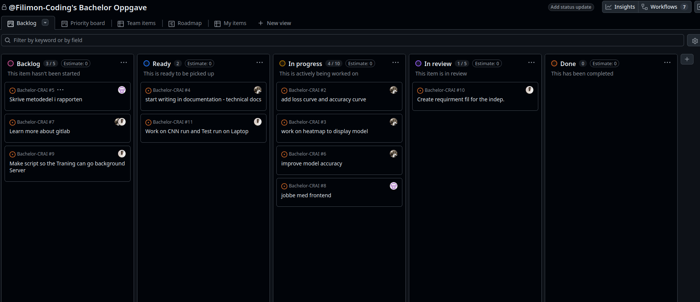

# Bachelor-CRAI

Vi diskutere og kom fram til vi skal bruke datasette fra The Cancer Imaging Archives(TCIA) link: https://www.cancerimagingarchive.net/collection/lidc-idri/
-- System utvikiling : utvikle model dere tenke å bruke 
        --> som eks. Brukerhistorie. 
        --> Github projekter. : Kanskje ikke bruke github actions

--> Dagbok AI lab 

--> Hedda marie westlin : Ansvarlig for de Pc for treningsmodell. Kontakt

-- Du tok feil anngående penumine sidene : Ja. finne faktisk bilde av kreft. 
--> Se om du kan trene dem og så teste med dems data hos CRAI sin data. 

-- > prøve finn hva som finnes der ute og han en litturate om lunge kreft som ble gjørt 
-- > Snakke om Accurcy 
-- > Tenke om Klient ha GPU eller CPU : Så om den modell fungere der bedre og.. osv . 
-- > 

MVP : 
-- Hva minimal valible produkt : 

hva kan vi utføre! 
Så skrive ned det. 

Onsdagen 15:30 neste møte :: 

notatene fra møtet med Trym i går (21/1): Mvp - snakke med ekstern veileder om hva de tenker? Lage noe som de faktisk er ute etter. 
Intervjuer med brukere når det kommer til dette.
lage risikoanalyse (putte i risikoanalyse: problem med å finne data). 
datasett -> bruke chatgpt (gjøre bredt søk i starten), legge punkter på hva vi er ute etter. Deep research på GPT (trykke på + og gjøre Deep research). Verifisere etterpå om det faktisk er det vi ute etter. Bra for å undersøke hvilke modeller som finnes. 
Snakke med ekstern om å teste data der? og om de har ressurser til å trene modellene våres? 
Kan fortsatt bruke datasett med annen data enn av lungesvulst, fordi da lærer modellen seg å gjenkjenne hva som er lungekreft og hva som er de andre tingene. Bare sjekk hvor mange label det er av lungekreft - og bør ha balansert labels av dataene.
Se på lisensen på data hvis det feks ligger på github - om tillatelse til å bruke data. Sjekke lisenser - og skrive om i rapporten også under risikoanalyse. 
Legge til filter i Kaggle ved søk (Image Classification): https://www.kaggle.com/datasets?search=Lung+cancer&tags=16686-Image+Classification 
Tips ved søk: Bruke logikk som f.eks. AND ved google søk. 
Se på phd-avhandling av automatic detection and classification of lung cancer.. (den har litteratur i bio også, se datasett s.63), link: 

Neste møte 4/2 Onsdag 15.30.
 
Ml ops oppsettet - ML flow brukes til sånn type tracking (tracking av parametre)
 
Klassifisering (gjennom heatmap)
 
Utdype noen punkter i forprosjektrapporten: som Hvordan frontend skal se ut.
Ta med risikoanalyse i forprosjektrapporten (sannsynlighet, konsekvens og håndtering)
 
Ha noen brukerhistorier: hva slags metrix de er ute etter? - hva som gjør at de stoler på dette systemet?
Se på Trustworthyness av AI (passe på at treningsdataet faktisk blir på selve lungene og ikke noe rundt). - Dette kommer fint fram gjennom heathmap metoder. 
 
Tenke på hva som kan gjøres i parallell for å klare å komme i mål.
Jobbe med applikasjonsframeworket (frontend) samtidig som datasettet /litteraturstudie.
Begynne å tenke på design av pipeline allerede nå.
Referere det tilbake til emnet vi har hatt om dette med "planlegging": Systemutvikling.
Prosjektdokumentasjon kan foregås hele tiden. 
 
Ikke bruke ordet startup om prosjektet.
 
Satero / Zotero?? - for å holde styr på litteraturen (samle og lagre litteratur) - som extencion i word?. Man kan dele sånn at man har felles bibliotek mellom flere personer. Satero gir fin mappestruktur.

MØTE 4/2 NOTATER:
Neste møte: onsdag 11/2 kl. 15.30
 
Python-pakker som kan gjøre det automatisk Scikit-learn (dele opp malign og benigne svulster).
Boxel-basert modell som leser det som 3D-modell - blir heavy for nettsiden/applikasjon? Får da større modell, computemessig blir det ikke større.
Bedre resultater av å bruke hele datasettet - for å sjekke at pipeline funker starte med mindre.
K-fold cross-validation (metode for å dele opp datasettet)
Test vs. validation
Må ha et datasett som du tester på en gang til slutt (ikke det samme som ble brukt til testdata).
Lese om dataloaders, finnes på PyTorch.
Virtuell environment lar deg ikke kjøre på tvers av OS (feks Linux og windows). Bruke heller docker?
Sette opp at docker bruker Poetry (open source), Poetry mer etablert.
UV (ultraviolet) -> raskere.
Pipeline: Dicom -> nifti -> PyTorch
 
Videre arbeid:
Se på CNN-modell (RestNet)
Begynne å lage FrontEnd
Brukertesting? - hva ønsker dere å se? Osv. Helst Lege/Radiologer, men også ok med studenter (tannlege, medisin, fysio).
Ta kontakt med Hedda om GPUene nevne størrelsen på datasett til henne - sende mail til henne.

80 prosent after 20 epochs - rest-net-test.py

Gruppe møte 12.02.26
Vi begynner å bruke Burndown chart for holde kontroll på progress 

